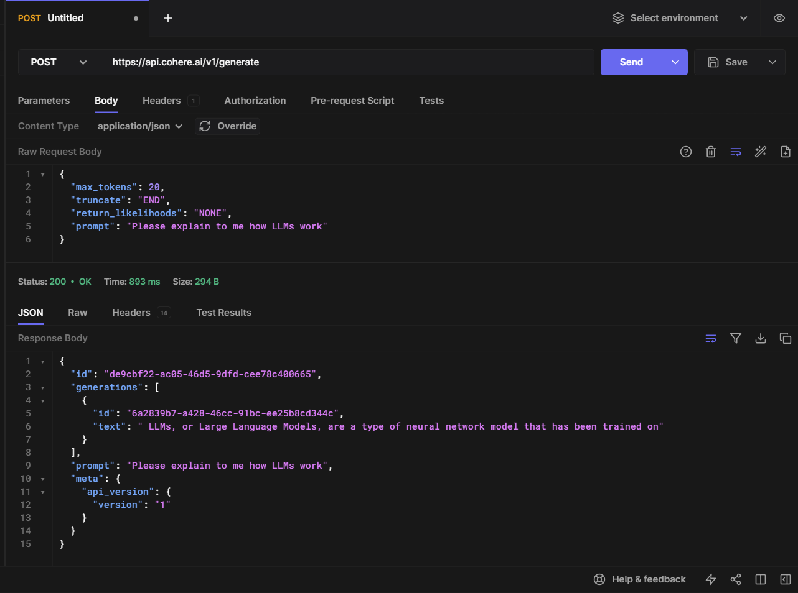

# CSC207 Brainstorming

## Problem Domain: 
Our project falls in the **entertainment domain**. Currently, there are no widespread custom solution for user entertainment. They are restricted to existing tv shows, books, etc and are not free to channel their imagination. Our project seeks to tackle this issue by providing the user with a custom course of entertainment which can meet any of their wants.

## Description: 
A story/movie generator. The user simply needs to enter a prompt, for example, "There was a young girl who fought unicorns in 19th century England". The the user will then choose if they want a storybook or movie format, and based on that we will give either a give a movie with realistic scenes and audio or a storybook with vivid pictures and text.

## API Documentation:
* [Google Cloud API](https://cloud.google.com/text-to-speech/docs/samples) - Text to Speech functionality
* [DALL E2](https://openai.com/dall-e-2) - Create realistic images & art from text descriptions
* [Cohere AI](https://txt.cohere.com/generative-ai-part-5/) - Generate storyline from text prompt


## Using Tools To Call APIs:

Example call using hoppscotch.io to call Cohere's co.generate() API endpoint

## Example API Calls in Java:
```java
// In CohereAPI.java
String completion = getResponse("How are you doing today?");
System.out.print(completion);

// Outputs " As an AI language model, I don't have any emotions or feelings, so I can't say"
```

```java
// In dalle2Call.java
tryTheImageModel(apiKey, "teddy writing a blog in times square");
// Outputs the image below:
```


